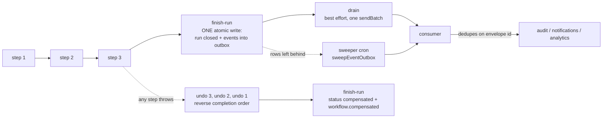
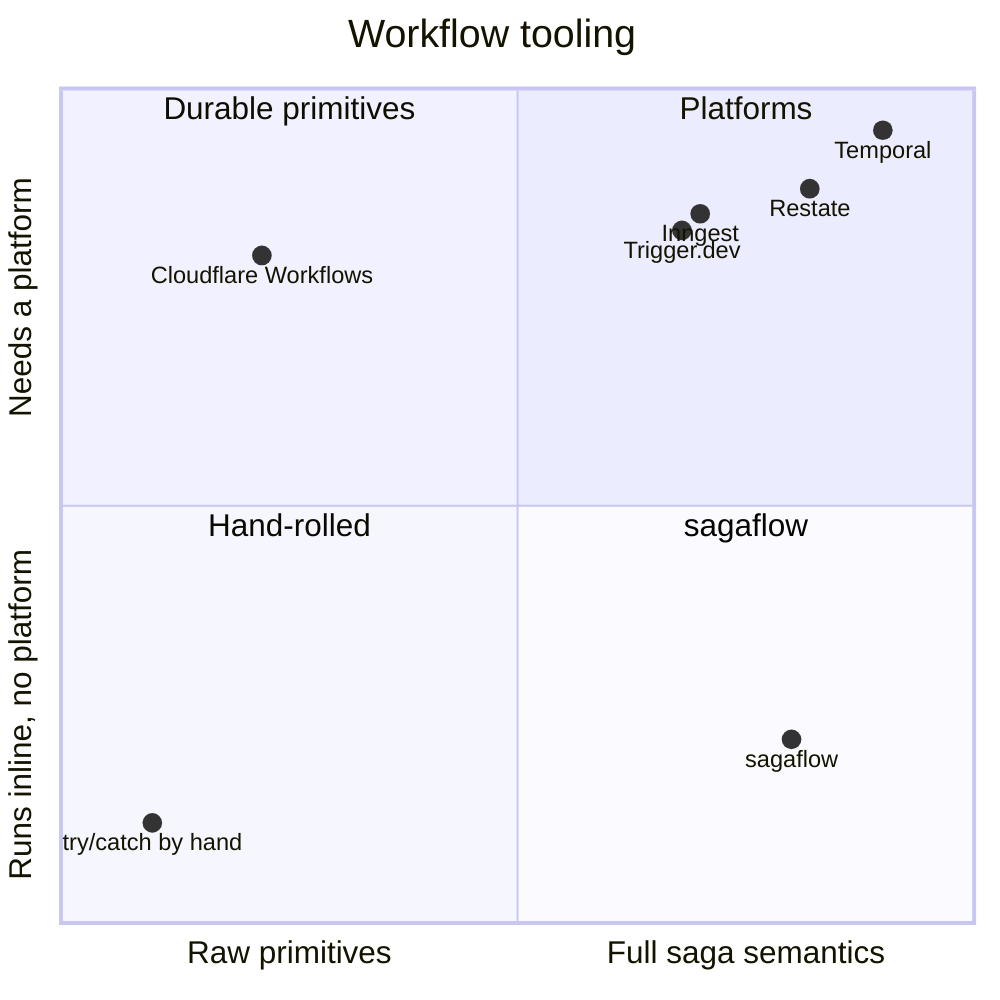

# sagaflow

[](https://github.com/bayraak/sagaflow/actions/workflows/ci.yml)
[](https://www.npmjs.com/package/sagaflow)
[](./LICENSE)

**An embedded saga engine for TypeScript. Workflows that undo themselves, leave a record, and
announce themselves once — inline in a request or durably on Cloudflare Workflows.**

Sagas for TypeScript — compensating workflows that run inline in a request or durably on a
workflow engine. Cloudflare Workflows adapter included.

Zero runtime dependencies. Your database, your tables, your process.

---

## Sixty seconds

```bash
bun add sagaflow    # or: npm i sagaflow / pnpm add sagaflow
```

```ts
import { createStep, defineWorkflow } from 'sagaflow'
import { createMemoryJournal, createMemorySink } from 'sagaflow/memory'
import { z } from 'zod'

// --- your application ---------------------------------------------------
const issued: number[] = []
const nextInvoiceNumber = async () => {
  issued.push(issued.length + 1)

  return issued.at(-1) as number
}
const releaseInvoiceNumber = async (number: number) => {
  issued.splice(issued.indexOf(number), 1)
}
// ------------------------------------------------------------------------

const reserveNumber = createStep(
  'reserve-number',
  async (_input: { customerId: string }) => {
    const number = await nextInvoiceNumber()

    return { output: number, compensateWith: number }
  },
  async (number) => releaseInvoiceNumber(number),
)

const createInvoice = defineWorkflow(
  {
    name: 'invoice.create',
    input: z.object({ customerId: z.string() }),
    execution: 'inline',
  },
  async (input, wf) => {
    const number = await wf.step(reserveNumber, input)
    wf.emit('invoice.created', { customerId: input.customerId, number })

    return { number }
  },
)

const { journal } = createMemoryJournal()
const { sink } = createMemorySink()

const result = await createInvoice.run({
  input: { customerId: 'cus_1' },
  ctx: { tenantId: 'acme', journal, events: sink },
})
```

That is a complete saga: validated input, a step that knows how to undo itself, a run record,
and an event that is written down atomically with the run and delivered afterwards. Swap
`sagaflow/memory` for a real journal and nothing above changes.

Every example in this README is compiled and executed by the test suite
([`test/readme-example.test.ts`](./test/readme-example.test.ts)).

---

## Why

You already know how to write the happy path. What costs you weekends is everything around it:

- **Undoing half a mutation.** The charge went through, the shipment did not, and something has
  to refund the charge — in the right order, even when one of the undos itself fails.
- **Explaining what happened.** Three weeks later somebody asks why customer 4021 was invoiced
  twice, and the only record is a log line that has rotated away.
- **Announcing it exactly once.** The mutation committed and the queue was down, so either the
  caller was told its committed work failed, or the audit trail quietly vanished.
- **The same request twice.** A retry, a double-click, a cron that fired twice.

Cloudflare Workflows gives you durability — checkpoints, retries, sleeps that survive a deploy.
It does not give you compensation, a run record you can query, an outbox, or any way to run the
same definition inline inside a request. sagaflow is those four things, and it runs with or
without a durable platform underneath.

**Transactions for the distributed write path.** The analogy is exact:

| A database has    | sagaflow has                              |
| ----------------- | ----------------------------------------- |
| write-ahead log   | the run record and its step trail         |
| rollback          | compensation, in reverse completion order |
| commit            | the `finish-run` batch                    |
| replication log   | the outbox                                |
| unique constraint | the idempotency key                       |

---

## Concepts

|                    |                                                                                                                                                           |
| ------------------ | --------------------------------------------------------------------------------------------------------------------------------------------------------- |
| **Step**           | A unit of work that knows how to undo itself. Returns `{ output, compensateWith }`; the undo is registered from the returned value, never from a closure. |
| **Workflow**       | A named definition with a validated input, a body, and an execution mode.                                                                                 |
| **Run**            | One execution of a workflow. Has an id, a status, an input, an output, and a step trail.                                                                  |
| **Journal**        | Where runs, steps and the outbox live. A contract with adapters — your tables, not ours.                                                                  |
| **Sink**           | Where events go. Structurally a Cloudflare Queue: `{ sendBatch }`.                                                                                        |
| **Step primitive** | How a durable platform runs a step. Cloudflare Workflows is the shipped one.                                                                              |

A run walks its steps, holds what it emits, and closes:



---

## Guarantees

Say which is which, out loud, so nobody has to guess:

| Property                              | Guarantee                              | What that means                                                                                                                    |
| ------------------------------------- | -------------------------------------- | ---------------------------------------------------------------------------------------------------------------------------------- |
| Run closed **and** its events written | **Atomic**                             | One write. "Completed, audit trail lost" is not a representable state.                                                             |
| Event delivery to your sink           | **At-least-once**                      | The drain is best effort; a sweeper carries whatever it could not. Consumers dedupe on the envelope id.                            |
| Envelope ids                          | **Deterministic**                      | `${runId}:${ordinal}`. Re-invoking a run produces the same ids, so a repeat is recognisable.                                       |
| Same idempotency key, twice           | **Answered, not re-run**               | While a run holds the key. A run that failed, compensated or was cancelled releases it.                                            |
| Step effects on retry                 | **Your call, with help**               | `ctx.idempotencyKey` is stable across attempts and replays. Hand it to a provider; we cannot make someone else's API exactly-once. |
| Compensation                          | **Every registered undo is attempted** | In reverse completion order. If one refuses, the rest still run and the run closes `failed`, not `compensated`.                    |
| Cancellation                          | **Cooperative**                        | Takes effect at the next step boundary. A step already running is never interrupted.                                               |
| Durable replay                        | **Steps memoised by name**             | The body re-runs; completed steps do not. Never reshape a deployed durable workflow — see [versioning](./docs/versioning.md).      |

There is no exactly-once delivery here, and nobody else has one either. What there is: an
identity on every message and an outbox that never loses one.

---

## Inline or durable

Same definition, two executors. Choose **durable** when any of these hold, **inline** otherwise:

- side effects outside your own database (email, a payment provider, the outside world)
- more than roughly a second of work
- sleeps, waits for events, a human in the loop
- fan-out
- it must survive a crash

Inline is for short mutations against your own database — a document save on blur stays snappy
because the answer comes back in the same request. It runs anywhere: Bun, Node, Deno, any
framework, any journal, no infrastructure.

Durable mode needs a `StepPrimitive`. Cloudflare Workflows is the one that ships.

The difference is a compile error, not a convention: an inline definition has `.run()` because
the caller is still holding the request open; a durable one does not — it is started with
`startDurableWorkflow` and an instance runs it later. Only a durable body has `sleep` and
`waitForEvent`.

```ts
const chase = defineWorkflow(
  {
    name: 'invoice.chase',
    input: z.object({ invoiceId: z.string() }),
    execution: 'durable',
  },
  async (input, wf) => {
    await wf.sleep('grace-period', '7 days')
    const paid = await wf.waitForEvent<{ paid: boolean }>('payment', {
      type: 'invoice.paid',
      timeout: '30 days',
    })

    if (paid.paid) return { chased: false }

    await wf.step(remind, input)

    return { chased: true }
  },
)
```

---

## Compensation leaves a trail

```ts
const charge = createStep(
  'charge-card',
  async (input: { customerId: string; amount: number }, ctx) => {
    // ctx.idempotencyKey is `${runId}:${seq}` — the same on every attempt and every replay of
    // this step. Hand it to your provider's idempotency header.
    const chargeId = await payments.charge(input, { idempotencyKey: ctx.idempotencyKey })

    return { output: { chargeId }, compensateWith: chargeId }
  },
  async (chargeId) => payments.refund(chargeId),
)

const ship = createStep('ship-order', async () => {
  throw new Error('out of stock')
})
```

When `ship-order` throws, the run undoes what it did and writes down every leg of it:

| seq | name                     | status      |
| --- | ------------------------ | ----------- |
| 0   | `charge-card`            | completed   |
| 1   | `ship-order`             | failed      |
| 2   | `compensate:charge-card` | compensated |

and the run closes `compensated`. Had the refund itself refused, the run would close **failed**
— because `compensated` tells a reader the customer was left whole, and they were not.

---

## The same request, twice

```ts
const sendReceipt = defineWorkflow(
  {
    name: 'receipt.send',
    input: z.object({ invoiceId: z.string() }),
    execution: 'inline',
    idempotency: (input) => `receipt.send:${input.invoiceId}`,
  },
  async (input, wf) => {
    await wf.step(send, input)

    return { sent: input.invoiceId }
  },
)

const first = await sendReceipt.run({ input: { invoiceId: 'inv_1' }, ctx })
const second = await sendReceipt.run({ input: { invoiceId: 'inv_1' }, ctx })
// second.deduplicated === true, second.runId === first.runId, second.output === first.output
```

The key is held by runs that are **running** or **completed**. A run that failed, compensated or
was cancelled releases it — an invoice whose send fell over can be sent again, which is the
whole point of asking twice.

Keys are per tenant. An input can be the same string for every tenant ("the spending report for
March" is), and a key that left the tenant out would let the first tenant to ask claim the work
for everybody.

---

## Cancellation

```ts
import { requestCancellation } from 'sagaflow'

await requestCancellation(journal, { tenantId, runId })
```

Cooperative, and deliberately so: nothing here can interrupt somebody else's code mid-step, and
a library that claimed otherwise would be making the dangerous kind of promise. The request is a
flag on the run record; the engine reads it back from the value `recordStep` already returns, so
noticing it costs no extra round trip. It takes effect at the **next step boundary**: the step in
flight finishes, no further step starts, everything already done is undone in reverse, and the
run closes `cancelled` — or `failed`, if an undo refused.

---

## Events and the outbox

`wf.emit(type, payload)` in a body, `ctx.emit(...)` in a step. Emissions are **held** until the
run succeeds, so a run that was undone never announces a change that did not happen. They are
written into your outbox table **in the same atomic write that closes the run**, and delivered
afterwards.

Declare `eventSchemas` on the runtime and `emit` is typed to your own event names and validated
against your own schemas:

```ts
const ctx = {
  tenantId,
  journal,
  events: sink,
  eventSchemas: {
    'invoice.created': z.object({ customerId: z.string(), number: z.number() }),
    'invoice.paid': z.object({ invoiceId: z.string() }),
  },
}
```

Two facts about the run itself are always emitted by the engine:

| Event                  | When                            | Payload                           |
| ---------------------- | ------------------------------- | --------------------------------- |
| `workflow.completed`   | the run finished                | `{ runId, name }`                 |
| `workflow.compensated` | the run was undone or cancelled | `{ runId, name, error, outcome }` |

A compensated run's outbox holds exactly that one event and nothing the body emitted: the change
did not happen, but the fact that the run was undone is something an audit log and an operator
both want.

Delivery is at-least-once. Run `sweepEventOutbox` on a schedule for whatever a run's own drain
could not deliver, and dedupe on the envelope id at the consumer.

```ts
import { sweepAbandonedRuns, sweepEventOutbox } from 'sagaflow'

await sweepEventOutbox({ journal, sink, olderThanMs: 60_000 })
await sweepAbandonedRuns(journal, { olderThanMs: 15 * 60_000 })
```

`sweepAbandonedRuns` closes inline runs whose process died — the ones that would otherwise say
`running` for as long as the table exists. Durable runs are never touched at any age: one may be
asleep for a week.

---

## Journals: your tables, not ours

sagaflow writes three tables through whatever already talks to your database. Bring your ORM's
executor; we bring the SQL.

| Adapter       | Import            | For                                                  |
| ------------- | ----------------- | ---------------------------------------------------- |
| Memory        | `sagaflow/memory` | tests, and the worked reference for writing your own |
| Cloudflare D1 | `sagaflow/d1`     | Workers                                              |
| SQLite        | `sagaflow/sqlite` | `bun:sqlite` / `node:sqlite`                         |

The contract is nine methods ([`docs/journal.md`](./docs/journal.md)); an adapter is a small file.
The default tables are `saga_runs`, `saga_run_steps` and `saga_outbox`, and their names are
configurable — sagaflow does not own your schema, your migration tool does. See
[`docs/adapters.md`](./docs/adapters.md) for how to write a journal, a sink or a step primitive.

---

## Deploy

### Inline, anywhere

1. `bun add sagaflow`
2. Apply the DDL with your own migration tool.
3. Build a runtime per request: `{ tenantId, journal, events? }`.
4. Call `workflow.run({ input, ctx })` in your handler.
5. Deploy however you already deploy.
6. Schedule `sweepAbandonedRuns`, and `sweepEventOutbox` if you emit events.

No account, no credentials, no service. The journal is the only hard requirement — the queue is
optional, and without one the outbox simply holds your events until you read them yourself.

### Durable, on Cloudflare

`wrangler.jsonc` needs a `d1_databases` entry for the journal, a `workflows` binding whose
`class_name` is the class `createWorkflowEntrypoint` returns, a `queues` producer and consumer if
you want events delivered, and two crons:

```jsonc
"triggers": { "crons": ["*/5 * * * *", "*/10 * * * *"] }
```

one for `sweepEventOutbox`, one for `sweepAbandonedRuns`. Export the entrypoint class from your
worker module, apply `schema.sql` with `wrangler d1 migrations apply`, and deploy. **Named
environments inherit nothing** — repeat every binding in every environment block. Redeploys obey
[`docs/versioning.md`](./docs/versioning.md).

[`examples/cloudflare-worker`](./examples/cloudflare-worker) is the copyable template.

### What it costs you

- **Local development and the whole test suite need no Cloudflare account and no credentials.**
- Deploying needs a Cloudflare account; the Workers **Paid** plan only if you use Queues.
- Authenticate with `wrangler login`, or set `CLOUDFLARE_API_TOKEN` and `CLOUDFLARE_ACCOUNT_ID`.
- Create resources from the CLI: `wrangler d1 create <name>` (paste the `database_id` into
  `wrangler.jsonc`), `wrangler queues create <name>`, then `wrangler d1 migrations apply` and
  `wrangler deploy`.
- **sagaflow itself needs no secret, no key and no account of any kind.**

---

## Testing

A `StepPrimitive` that just runs the body drives a durable definition with no platform at all:

```ts
const platform: StepPrimitive = {
  do: async (_name, _config, run) => run({ attempt: 1 }),
  sleep: async () => undefined,
  waitForEvent: async () => ({ paid: false }) as never,
}

await executeDurable(chase, { runId, input }, ctx, platform)
```

Suites that need retry or replay behaviour implement `do` accordingly — a fake that caches
results by name reproduces exactly what a real platform does on re-invocation. Inline definitions
need no seam at all: call `.run({ input, ctx })`.

`createMemoryJournal()` returns the journal plus the rows it holds (`runs`, `steps`, `finishes`,
`outbox`, `dispatched`), so a test asserts on what was written rather than on what was called.

---

## Versioning law

> - **Never** reshape a deployed durable workflow's steps — renaming or reordering them. In-flight
>   instances replay completed steps **by name** from the platform's journal.
> - Version semantic changes by name (`invoice.send.v2`), let v1 instances drain, then retire it.

The same rule is why a step used more than once in one run needs `namedStep(step, 'chunk-3')`:
the journal is keyed by step name, so two uses under one name are one step to the platform — the
second would be handed the first one's memoised result and its work would never happen.
`createStep` refuses the names the engine uses for itself. Full rules:
[`docs/versioning.md`](./docs/versioning.md).

---

## Where it sits



## What you get, and what you don't

**We ship:** the engine and its semantics · three contracts (journal, sink, step primitive) · a
reference schema of three tables · adapters for memory, D1 and SQLite · a Cloudflare step
primitive and entrypoint helper.

**We do not ship:** a database · a server · a dashboard · a scheduler. Run state lives in **your**
tables, which means you can query it, join it, back it up, put row-level security on it and hand
it to an agent. The durable engine is the platform's. The sweepers are your cron.

## What it does not do

- **No flow control.** No per-tenant concurrency limits, throttling or debouncing. If you need
  them: a Durable Object per key, or your queue consumer's concurrency settings.
- **No signals, queries or child workflows as primitives.** Starting a durable workflow from a
  step and keying it on the parent run id is the documented pattern; undoing it is cancelling it.
- **No deterministic code replay.** The body re-runs on a durable invocation; your steps are what
  is memoised. Keep non-determinism inside steps.
- **No exactly-once side effects.** Nobody has these. You get a stable idempotency key per step.
- **No UI.** Your run records are rows in your own database — query them, or point an agent at
  them.
- **Durable mode is Cloudflare-only today.** The `StepPrimitive` seam is about twenty lines;
  Inngest's `step.run` / `step.sleep` / `step.waitForEvent` is the same shape.

## Why not X

|                           | What it does that sagaflow does not                                            | What sagaflow does that it does not                                          |
| ------------------------- | ------------------------------------------------------------------------------ | ---------------------------------------------------------------------------- |
| **Temporal**              | Deterministic replay, signals/queries, child workflows, a UI, decades of scale | Runs inline in a request; no cluster; no dependencies; your tables           |
| **Restate**               | Durable promises, virtual objects, its own runtime                             | No server to run; inline mode; compensation as a first-class concept         |
| **Inngest / Trigger.dev** | Hosted platform, dashboards, flow control, scheduling                          | Library not platform; no vendor in the write path; your run records          |
| **Cloudflare Workflows**  | Durability, checkpoints, retries, sleeps that survive deploys                  | Compensation, a run record you own, a transactional outbox, inline mode      |
| **A job queue**           | Fan-out, backpressure, retries                                                 | Ordered undo, atomic outbox, per-tenant idempotency, a queryable trail       |
| **try/catch by hand**     | Nothing to learn                                                               | The undo order, the trail, the outbox and the dedupe you were about to write |

Longer and fairer: [`docs/comparison.md`](./docs/comparison.md).

---

## FAQ

**Do I need Cloudflare?** No. Inline mode runs anywhere and needs no platform. Cloudflare is one
`StepPrimitive` implementation, shipped because it is the one in production use.

**Do I need a queue?** No. The journal is the only hard requirement. Without a sink the outbox
holds your events and you read them yourself.

**Can I use my ORM?** Yes — a journal adapter needs `run`, `all` and an atomic `batch`, which
every ORM exposes underneath. Bring your executor.

**Is this a state machine library?** No. A run is a trivial linear machine
(`running → completed | compensated | failed | cancelled`) and steps are a log, not a graph. The
axis is transactions, not diagrams.

**What happens if my process dies mid-run?** An inline run is left `running` until
`sweepAbandonedRuns` closes it and says why. A durable run is resumed by the platform, and the
engine is built for exactly that: replayed steps are not re-executed, and the events are written
once.

**Can I emit events from a compensation?** You can, and they are dropped with the run — a change
that did not happen is not announced. The run's own `workflow.compensated` is what gets written.

---

## Documentation

- [`docs/design.md`](./docs/design.md) — the one engine, the outbox, and what is atomic
- [`docs/journal.md`](./docs/journal.md) — the `RunJournal` contract, method by method
- [`docs/adapters.md`](./docs/adapters.md) — writing a journal, a sink or a step primitive
- [`docs/cloudflare.md`](./docs/cloudflare.md) — bindings, entrypoint, cron sweepers
- [`docs/versioning.md`](./docs/versioning.md) — what you must never reshape
- [`docs/comparison.md`](./docs/comparison.md) — the honest landscape
- [`SKILL.md`](./SKILL.md) — for coding agents working in a sagaflow codebase

## Examples

- [`examples/bun-inline`](./examples/bun-inline) — a plain Bun HTTP server, no Cloudflare anywhere
- [`examples/cloudflare-worker`](./examples/cloudflare-worker) — inline and durable, on Workers
- [`examples/with-valibot`](./examples/with-valibot) — the same, with Valibot instead of Zod

## License

MIT © Bayram Ali Basgul
