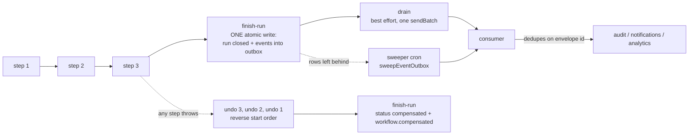
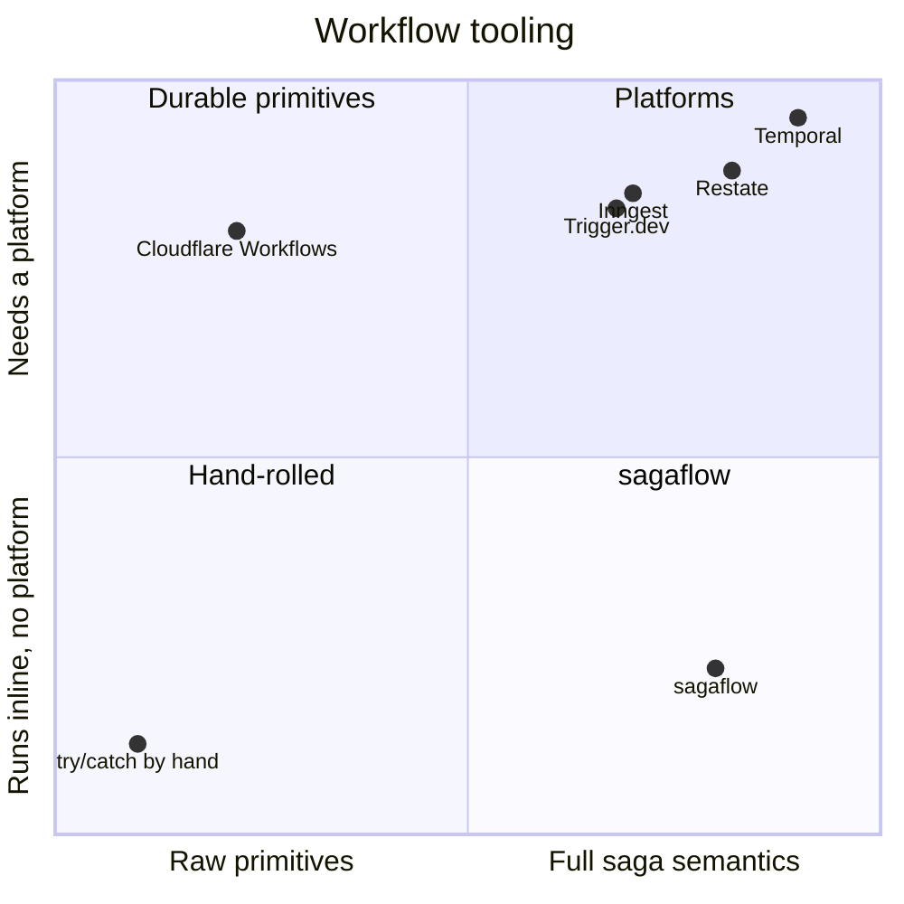

# sagaflow

[](https://github.com/bayraak/sagaflow/actions/workflows/ci.yml)
[](https://www.npmjs.com/package/@bayraak/sagaflow)
[](./LICENSE)

**An embedded saga engine for TypeScript. Workflows that undo themselves, leave a record, and
announce themselves once — inline in a request or durably on Cloudflare Workflows.**

Sagas for TypeScript — compensating workflows that run inline in a request or durably on a
workflow engine. Cloudflare Workflows adapter included.

Zero runtime dependencies. Your database, your tables, your process.

**sagaflow adds no runtime. Every workflow is an async function; every fact is a row.** Bodies
are `async`/`await`, validation is [Standard Schema](https://standardschema.dev) so you bring the
validator you already have, ids come from Web Crypto, state is SQL you can read, and the sink is
Queue-shaped. There is no custom runtime, no compiler step, no directives, no decorators and no
generator-only API to learn.

**Make every write a saga.** Not the occasional long-running job — every write. That is only a
reasonable thing to ask if it is cheap and if the promises are checkable, so both are on the
table: the [cost](#exactly-what-it-guarantees) in journal round trips, the
[six guarantees](#exactly-what-it-guarantees) each linked to the test that proves it, and the
same definition running durably on a platform when a write needs to survive a crash. The engine
was extracted from a production backend where 57 workflows carry every mutation it makes.

The thing this actually competes with is not a platform. It is the `try`/`catch` cleanup block
you were about to write, and the `await queue.send()` on the line after the commit.

---

## Sixty seconds

```bash
bun add @bayraak/sagaflow    # or: npm i @bayraak/sagaflow / pnpm add @bayraak/sagaflow
```

```ts
import { saga, step, emit } from '@bayraak/sagaflow'

const createBooking = saga('booking.create', async (input: { seat: string }) => {
  const seat = await step(
    'reserve',
    () => seats.reserve(input.seat),
    (reserved) => seats.release(reserved.id),
  )
  await step('charge', () => cards.charge(seat.price))
  await emit('booking.created', { seatId: seat.id })

  return seat
})

await createBooking({ seat: '12A' })
```

### In a real application: wrap the door

Effects usually arrive through one object — a queries module, a service, a binding. Wrap it once
and every body that uses it is plain code:

```ts
import { actions } from '@bayraak/sagaflow'

export const seats = actions(seatService, {
  reserve: {
    undo: (held) => seatService.release(held.id),
    announce: (held) => ['seat.reserved', { id: held.id }],
  },
  release: null, // irreversible, and said so on purpose
  trace: true, // report every call as a span; journal only the effects
})

const createBooking = saga('booking.create', async (input: { seat: string }) => {
  if (!(await seats.available(input.seat))) throw new Error('that seat is taken')

  return seats.reserve(input.seat)
})
```

`reserve` is listed, so it is a recorded, retried, undoable step that announces what it did.
`available` is not, so it stays a plain call — except inside a **durable** saga, where it is
memoised so a replay sees what the first invocation saw. **Outside a saga the wrapped object is
the object**, so every caller that is not a saga keeps working and there is no second import to
choose between.

`satisfies UndoSpec<Writes>` makes it a compile error to add a write without deciding how to undo
it. `null` is a decision, written down.

### Or bind the undo to one effect at a time

Repeating the undo at every call site is where it goes wrong — the fourth caller forgets, and the
run that needed it most is the one that cannot be taken back. Write it once, beside the thing it
reverses:

```ts
import { action } from '@bayraak/sagaflow'

export const reserveSeat = action(seats.reserve, { undo: (held) => seats.release(held.id) })
export const chargeCard = action(cards.charge, { undo: (receipt) => cards.refund(receipt.id) })

const createBooking = saga('booking.create', async (input: { seat: string }) => {
  const seat = await reserveSeat(input.seat)
  await chargeCard(seat.price)
  await emit('booking.created', { seatId: seat.id })

  return seat
})
```

Inside a saga each call is a step — named after the function, recorded, retried and undone like
any other. **Outside a saga it is exactly the function it wraps**, so the same
`reserveSeat` is safe to call from a script, a test or a route that is not a saga at all.

Use the inline `step(name, run, undo)` form for ad-hoc work that has no home of its own.

That is a complete saga: a step that knows how to undo itself, a run record, and an event
written down atomically with the run and delivered afterwards. It runs with nothing configured —
in memory, with one line telling you so. When you are ready:

```ts
import { sagaflow } from '@bayraak/sagaflow'
import { createSqliteJournal } from '@bayraak/sagaflow/sqlite'

const flow = sagaflow({ journal: createSqliteJournal(db), events: queue })

await createBooking({ seat: '12A' }, flow.for({ tenantId: 'acme', actor: user.id }))
```

Not one line of the saga changes.

**Verbs are awaited, reads are not.** `step`, `all`, `emit`, `sleep` and `waitForEvent` return
promises and every example awaits them; `ctx()` and `runId()` are plain reads. A step you start
and forget to await fails the run by name rather than letting it be recorded as completed while
it was still going — turn on `@typescript-eslint/no-floating-promises` and it never happens.

**Your workflow is an async function. `if`, `for` and `await` are the DSL.** There is no
transform, no `when`, no parallelize, and no parallel-group verb either — `Promise.all` already
is one:

```ts
const [invoice, receipt] = await Promise.all([
  step('invoice', () => render(order)),
  step('receipt', () => stamp(order)),
])
```

The engine records start order, waits for every in-flight step before it unwinds, and refuses a
body that returns while a step it started is still going. Racing belongs _inside_ a step, where
the platform memoises the winner — a race at the body level would be non-deterministic across a
replay, which is the one thing a durable body must not be.

Every example in this README is compiled and executed by the test suite
([`test/readme-example.test.ts`](./test/readme-example.test.ts)).

---

## The problem

A backend mutation rarely touches one thing. "Save the invoice" is a row, a counter, a file, an
email and an event.

- When the **third write fails**, the first two have already happened.
- When the request is **retried**, they happen twice.
- When it **succeeds**, nobody can later say what ran, in which order, under whose hand.
- And the event that should announce it is either sent **before** the commit (lying) or **after**
  it (lost on a crash).

Databases solved this inside one store decades ago: transactions, a write-ahead log, unique
constraints, a replication log. The distributed write path of an application has no equivalent.
So teams hand-roll try/catch cleanup, or adopt a durable-execution platform for every write and
pay instance latency and a second system of record for a 5 ms update.

### What sagaflow is

**The transaction layer for the application write path.** Every mutation becomes a **run**:

> validated input → steps that each declare their undo → one atomic finish that records the
> outcome **and** queues the run's events → delivery at least once, deduplicated by id.

The same definition executes **inline** inside the request — microseconds of overhead, no
instance, no platform — or **durably** on a workflow engine (Cloudflare Workflows today) when it
sleeps, waits, fans out, calls the outside world, or must survive a crash.

The run record and the outbox are rows in **your own database**.

The analogy is exact:

| A database has    | sagaflow has                         |
| ----------------- | ------------------------------------ |
| write-ahead log   | the run record and its step trail    |
| rollback          | compensation, in reverse start order |
| commit            | the `finish-run` batch               |
| replication log   | the outbox                           |
| unique constraint | the idempotency key                  |

---

## Exactly what it guarantees

Six promises, each one proved by a test you can read:

| #   | Guarantee                                                                                                                                                                                                                                                              | Proved by                                                                                                                                                     |
| --- | ---------------------------------------------------------------------------------------------------------------------------------------------------------------------------------------------------------------------------------------------------------------------- | ------------------------------------------------------------------------------------------------------------------------------------------------------------- |
| 1   | A step's effect is at most **one atomic write**; cross-step consistency is the compensation chain — run in **reverse start order**, **every** undo attempted, and the result written down as `compensated` (fully reversed) or `failed` (something is still standing). | [`engine.compensation`](./test/engine.compensation.test.ts) · [`engine.unwinding`](./test/engine.unwinding.test.ts) · [`parallel`](./test/parallel.test.ts)   |
| 2   | A run is `completed` **if and only if** its events are durably queued — one atomic batch. "Completed with its audit trail lost" is not a representable state.                                                                                                          | [`outbox`](./test/outbox.test.ts) · [`journal-failure`](./test/journal-failure.test.ts)                                                                       |
| 3   | Events are delivered **at least once** and are recognisable by a **deterministic id**, so a consumer sees each one once; a re-invoked durable body writes its events **once**.                                                                                         | [`engine.replay`](./test/engine.replay.test.ts) · [`engine.reinvocation`](./test/engine.reinvocation.test.ts) · [`outbox.sweep`](./test/outbox.sweep.test.ts) |
| 4   | An idempotency key is **held** by running and completed runs and **released** by failed, compensated and cancelled ones — per tenant. The same work asked twice is answered once; work that fell over can be asked for again.                                          | [`idempotency`](./test/idempotency.test.ts) · [`idempotency.released`](./test/idempotency.released.test.ts)                                                   |
| 5   | Every run ends in exactly one of `completed \| compensated \| failed \| cancelled`. Inline runs that die mid-request are swept to `failed`; cancellation is cooperative and compensates.                                                                               | [`cancellation`](./test/cancellation.test.ts) · [`sweep`](./test/sweep.test.ts)                                                                               |
| 6   | Every step has a **stable idempotency key** for the outside world; inputs and outputs are validated by **your own** schema library.                                                                                                                                    | [`step-idempotency-key`](./test/step-idempotency-key.test.ts) · [`schema`](./test/schema.test.ts) · [`output-schema`](./test/output-schema.test.ts)           |

What it costs is counted too, and asserted exactly, in
[`test/cost-model.test.ts`](./test/cost-model.test.ts): a three-step inline run is **five journal
round trips** (open, one per step, close) and a sixth when there is a sink to drain to; closing a
run is **one batch** of one update plus one row per event; recording a step and reading the
cancellation flag is **one batch of two statements**; delivery is **one send per hundred events**;
a re-invocation re-executes **nothing**. Those numbers are the design. A change to one of them is
a reviewed decision, never drift.

And the honest small print:

| Property                              | Guarantee                                                                                                     |
| ------------------------------------- | ------------------------------------------------------------------------------------------------------------- |
| Run closed **and** its events written | **Atomic** — one write                                                                                        |
| Event delivery to your sink           | **At-least-once** — the drain is best effort, a sweeper carries the rest, consumers dedupe on the envelope id |
| Envelope ids                          | **Deterministic** — `${runId}:${ordinal}`                                                                     |
| Step effects on retry                 | **Your call, with help** — we cannot make someone else's API exactly-once                                     |
| Cancellation                          | **Cooperative** — at the next step boundary; a step already running is never interrupted                      |
| Durable replay                        | **Steps memoised by name** — never reshape a deployed durable workflow                                        |

There is no exactly-once delivery here, and nobody else has one either. What there is: an
identity on every message and an outbox that never loses one.

### What it is not

- **Not a durable-execution engine.** It rides one when you want durability.
- **Not a state machine or state-management library.** A run is a trivial linear machine and
  steps are a log, not a graph.
- **Not a job queue.** No fan-out scheduling, no backpressure.
- **Not a platform or a dashboard.** There is no service to run and nothing to log into.
- **No isolation between concurrent sagas** beyond what your own steps enforce. Two runs touching
  the same row race exactly as two requests would; use your database's constraints and locks.
- **No flow control** — no per-tenant concurrency limits, throttling or debouncing (see below for
  what to reach for instead).

---

## Concepts

|                    |                                                                                                                                                                |
| ------------------ | -------------------------------------------------------------------------------------------------------------------------------------------------------------- |
| **Step**           | A unit of work that knows how to undo itself. The undo is handed exactly what the step returned, and is registered from that value rather than from a closure. |
| **Workflow**       | A named definition with a validated input, a body, and an execution mode.                                                                                      |
| **Run**            | One execution of a workflow. Has an id, a status, an input, an output, and a step trail.                                                                       |
| **Journal**        | Where runs, steps and the outbox live. A contract with adapters — your tables, not ours.                                                                       |
| **Sink**           | Where events go. Structurally a Cloudflare Queue: `{ sendBatch }`.                                                                                             |
| **Step primitive** | How a durable platform runs a step. Cloudflare Workflows is the shipped one.                                                                                   |

A run walks its steps, holds what it emits, and closes:



---

## Inline or durable

Same definition, two executors. Choose **durable** when any of these hold, **inline** otherwise:

- side effects outside your own database (email, a payment provider, the outside world)
- more than roughly a second of work
- sleeps, waits for events, a human in the loop
- fan-out
- it must survive a crash

Inline is the default, because inline is what most mutations are — a document save on blur stays
snappy because the answer comes back in the same request. It runs anywhere: Bun, Node, Deno, any
framework, any journal, no infrastructure.

Durable needs a `StepPrimitive`. Cloudflare Workflows is the one that ships.

The difference is a compile error, not a convention. An inline definition is **called**; a
durable one has `.start()` and no call signature worth using, and only a durable body may sleep
or wait:

```ts
import { saga, sleep, step, waitForEvent } from '@bayraak/sagaflow'

const chaseInvoice = saga(
  'invoice.chase',
  { input: z.object({ invoiceId: z.string() }), durable: true },
  async (input) => {
    await sleep('grace-period', '7 days')
    const paid = await waitForEvent<{ paid: boolean }>('payment', {
      type: 'invoice.paid',
      timeout: '30 days',
    })

    if (paid.paid) return { chased: false }

    await step('send-reminder', () => remind(input.invoiceId))

    return { chased: true }
  },
)

await chaseInvoice.start({ invoiceId: 'inv_1' }, flow)
```

## A saga inside a saga

Call one from inside another and it is not a second run. Its steps join the caller's trail under
its own name, its undos join the caller's chain, and its events are held with the caller's:

```ts
const chargeCard = saga('charge', async (input: { amount: number }) => {
  await step('authorise', () => payments.authorise(input.amount))

  return step('capture', () => payments.capture())
})

const placeOrder = saga('order.place', async (input: { seat: string }) => {
  await step('reserve', () => seats.reserve(input.seat))

  return chargeCard({ amount: 4200 })
})
```

The trail reads `reserve`, `charge/authorise`, `charge/capture`. One run, one compensation
chain. Called from outside a saga, `chargeCard` runs on its own as usual. There is no API for
this because it needed none.

## Undoing leaves a trail

```ts
const placeOrder = saga('order.place', async (input: { customerId: string; amount: number }) => {
  await step(
    'charge-card',
    // idempotencyKey() is `${runId}:${seq}` — the same on every attempt and every replay of this
    // step. Hand it to your provider's idempotency header.
    () => payments.charge(input, { idempotencyKey: idempotencyKey() }),
    (receipt) => payments.refund(receipt.chargeId),
  )
  await step('ship-order', () => warehouse.ship(input))

  return { placed: true }
})
```

### What belongs in a step

**Steps are for effects, and for anything you want in the record.** A pure check over data you
already hold can be plain code — if it throws, the run compensates and the error says why:

```ts
const placeOrder = saga('order.place', async (input: { seat: string; card: Card }) => {
  // Plain code. Throws, the run compensates, and the message is in the run record.
  if (!isEligible(input.card)) throw new Error('this card cannot be used for seat reservations')

  // A step, because it touches the world — and because you want it in the trail.
  await step(
    'reserve',
    () => seats.reserve(input.seat),
    (held) => seats.release(held.id),
  )
})
```

Wrap a pure check in `step()` only when you want it named in the trail, which is a real reason —
"which check refused" is often the question. Anything that touches the world — a query, a write,
a provider, a queue — is a step.

**One rule about undo data: the undo is handed exactly what the step returned.** A step that
needs something extra to undo itself returns it, and then its value says everything about what it
did — which is also what the run record holds and what the body was given.

When `ship-order` throws, the run undoes what it did and writes down every leg of it:

| seq | name                     | status      |
| --- | ------------------------ | ----------- |
| 0   | `charge-card`            | completed   |
| 1   | `ship-order`             | failed      |
| 2   | `compensate:charge-card` | compensated |

and the run closes `compensated`. Had the refund itself refused, the run would close **failed** —
because `compensated` tells a reader the customer was left whole, and they were not.

Undos run in reverse **start** order. Under concurrency that is not the same as reverse
completion order, and start order is the one that is stable: a durable re-invocation answers
completed steps from the journal instantly, so a completion-ordered unwind would differ between
the first invocation and the second.

The word is **undo** everywhere you write it. The status column and the lifecycle event say
`compensated`, because that is what the literature calls it and what the row means.

### Deciding rather than catching

```ts
const result = await placeOrder.try(input, flow)

if (!result.ok) {
  const { runId, outcome, failedStep, compensated } = result.error
  logger.warn({ runId, failedStep, undone: compensated })

  return reply.conflict(outcome)
}

return reply.created(result.value)
```

A saga that was undone is a normal outcome — the undo ran, the record is written, and there is a
decision to make. `try` answers with `{ ok: true, value, runId, deduplicated }` or
`{ ok: false, error }`, which is the shape every Result library in TypeScript already uses, so
wrapping it in yours is one line and depending on any of them is nobody's problem but yours. The
plain call throws the same `SagaError`.

**Interoperable with Result libraries by shape — no dependency.** `SagaError` and
`SagaCancelledError` also carry a literal `_tag`, so they slot straight into tagged-union error
handling.

## The same request, twice

```ts
const sendReceipt = saga(
  'receipt.send',
  { input: z.object({ invoiceId: z.string() }), idempotent: true },
  async (input) => {
    await step('send-email', () => mail.receipt(input.invoiceId))

    return { sent: input.invoiceId }
  },
)

await sendReceipt({ invoiceId: 'inv_1' }, flow)
await sendReceipt({ invoiceId: 'inv_1' }, flow) // does nothing; answers with the first result
```

`idempotent: true` derives the key from the input — a canonical rendering, so key order is not
meaning, with the saga's name in the key so two sagas given the same input do not collide. Pass a
function instead when the key means something to somebody else, or an `idempotencyKey` per call
when the caller knows better than the definition does.

The key is held by runs that are **running** or **completed**. A run that failed, was undone or
was cancelled releases it — an invoice whose send fell over can be sent again, which is the whole
point of asking twice.

Keys are per tenant. An input can be the same string for every tenant ("the spending report for
March" is), and a key that left the tenant out would let the first tenant to ask claim the work
for everybody.

## Cancellation

```ts
await flow.cancel(runId)
```

Cooperative, and deliberately so: nothing here can interrupt somebody else's code mid-step, and a
library that claimed otherwise would be making the dangerous kind of promise. The request is a
flag on the run record; the engine reads it back from the value `recordStep` already returns, so
noticing it costs no extra round trip. It takes effect at the **next step boundary**: the step in
flight finishes, no further step starts, everything already done is undone in reverse, and the
run closes `cancelled` — or `failed`, if an undo refused.

Be precise about _when_, because it matters in a durable run: the flag comes back with a step's
own record, so a run that is asleep or waiting for an event does not notice until it wakes and
its **next step has finished**. That step runs, and is then undone along with everything before
it. A body that catches the cancellation gets no further step — stopping is not the body's
decision. Cloudflare's `terminate()` is the hard kill, and it runs no sagaflow undos.

## Events and the outbox

`await emit(type, payload)` anywhere in a body or a step. Emissions are **held** until the run
succeeds, so a run that was undone never announces a change that did not happen. They are
written into your outbox table **in the same atomic write that closes the run**, and delivered
afterwards.

Declare `eventSchemas` on the runtime and `emit` is typed to your own event names and validated
against your own schemas:

```ts
const flow = sagaflow({
  journal,
  events: queue,
  eventSchemas: {
    'invoice.created': z.object({ customerId: z.string(), number: z.number() }),
    'invoice.paid': z.object({ invoiceId: z.string() }),
  },
})
```

Two facts about the run itself are always emitted by the engine:

| Event                  | When                            | Payload                           |
| ---------------------- | ------------------------------- | --------------------------------- |
| `workflow.completed`   | the run finished                | `{ runId, name }`                 |
| `workflow.compensated` | the run was undone or cancelled | `{ runId, name, error, outcome }` |

A compensated run's outbox holds exactly that one event and nothing the body emitted: the change
did not happen, but the fact that the run was undone is something an audit log and an operator
both want.

**Exactly one of them per closed run** — including the two endings that are easy to forget: a run
the sweeper closes because nobody was left to finish it, and a run whose platform refused to
start it after the record already existed. Both announce themselves like any other.

Delivery is at-least-once. Run `sweepEventOutbox` on a schedule for whatever a run's own drain
could not deliver, and dedupe on the envelope id at the consumer.

```ts
import { sweepAbandonedRuns, sweepEventOutbox } from '@bayraak/sagaflow'

await sweepEventOutbox({ journal, sink })
await sweepAbandonedRuns({ journal, olderThanMs: 15 * 60_000 })
```

`sweepAbandonedRuns` closes inline runs whose process died — the ones that would otherwise say
`running` for as long as the table exists. Durable runs are never touched at any age: one may be
asleep for a week.

---

## Journals: your tables, not ours

sagaflow writes three tables through whatever already talks to your database. Bring your ORM's
executor; we bring the SQL.

| Adapter       | Import                     | For                                                  |
| ------------- | -------------------------- | ---------------------------------------------------- |
| Memory        | `@bayraak/sagaflow/memory` | tests, and the worked reference for writing your own |
| Cloudflare D1 | `@bayraak/sagaflow/d1`     | Workers                                              |
| SQLite        | `@bayraak/sagaflow/sqlite` | `bun:sqlite` / `node:sqlite`                         |

The contract is nine methods ([`docs/journal.md`](./docs/journal.md)); an adapter is a small file.
The default tables are `saga_runs`, `saga_run_steps` and `saga_outbox`, and their names are
configurable — sagaflow does not own your schema, your migration tool does. See
[`docs/adapters.md`](./docs/adapters.md) for how to write a journal, a sink or a step primitive.

---

## Deploy

### Inline, anywhere

1. `bun add @bayraak/sagaflow`
2. Apply the DDL with your own migration tool.
3. Build a runtime per request: `{ tenantId, journal, events? }`.
4. Call `workflow.run({ input, ctx })` in your handler.
5. Deploy however you already deploy.
6. Schedule `sweepAbandonedRuns`, and `sweepEventOutbox` if you emit events.

No account, no credentials, no service. The journal is the only hard requirement — the queue is
optional, and without one the outbox simply holds your events until you read them yourself.

### Durable, on Cloudflare

`wrangler.jsonc` needs a `d1_databases` entry for the journal, a `workflows` binding whose
`class_name` is the class `createWorkflowEntrypoint` returns, a `queues` producer and consumer if
you want events delivered, and two crons:

```jsonc
"triggers": { "crons": ["*/5 * * * *", "*/10 * * * *"] }
```

one for `sweepEventOutbox`, one for `sweepAbandonedRuns`. Export the entrypoint class from your
worker module, apply `schema.sql` with `wrangler d1 migrations apply`, and deploy. **Named
environments inherit nothing** — repeat every binding in every environment block. Redeploys obey
[`docs/versioning.md`](./docs/versioning.md).

[`examples/cloudflare-worker`](./examples/cloudflare-worker) is the copyable template.

### What it costs you

- **Local development and the whole test suite need no Cloudflare account and no credentials.**
- Deploying needs a Cloudflare account; the Workers **Paid** plan only if you use Queues.
- Authenticate with `wrangler login`, or set `CLOUDFLARE_API_TOKEN` and `CLOUDFLARE_ACCOUNT_ID`.
- Create resources from the CLI: `wrangler d1 create <name>` (paste the `database_id` into
  `wrangler.jsonc`), `wrangler queues create <name>`, then `wrangler d1 migrations apply` and
  `wrangler deploy`.
- **sagaflow itself needs no secret, no key and no account of any kind.**

---

## Testing

A saga is an async function, so testing one is calling it:

```ts
import { createMemoryJournal, createMemorySink } from '@bayraak/sagaflow/memory'

const journal = createMemoryJournal()
const sink = createMemorySink()
const flow = sagaflow({ journal: journal.journal, events: sink.sink })

await createBooking({ seat: '12A' }, flow)

expect(journal.runs[0]).toMatchObject({ status: 'completed' })
expect(journal.steps.map((row) => row.name)).toEqual(['reserve', 'charge'])
expect(sink.sent.map((event) => event.type)).toContain('booking.created')
```

`createMemoryJournal()` hands back the journal plus the rows it holds — `runs`, `steps`,
`finishes`, `outbox`, `dispatched` — so a test asserts on what was written rather than on which
function was called. No clock to stub, no platform to stand up, milliseconds per test.

For a **durable** definition, a `StepPrimitive` that just runs the body drives it with no
platform at all:

```ts
const platform: StepPrimitive = {
  do: async (_name, _config, run) => run({ attempt: 1 }),
  sleep: async () => undefined,
  waitForEvent: async () => ({ paid: false }) as never,
}

await executeDurable(definitionOf(chaseInvoice)!, { runId, input }, flow.runtime, platform)
```

A fake that caches results by name reproduces exactly what a real platform does on
re-invocation; one that calls `run` more than once reproduces retries.

Writing a journal adapter? Do not write your own suite — `journalConformance` from
`@bayraak/sagaflow/testing` is the contract as thirty-five executable cases, runnable under any test
runner.

## Versioning law

> - **Never** reshape a deployed durable workflow's steps — renaming or reordering them. In-flight
>   instances replay completed steps **by name** from the platform's journal.
> - Version semantic changes by name (`invoice.send.v2`), let v1 instances drain, then retire it.

The same rule is why fan-out needs a name per item:

```ts
for (const recipient of recipients) {
  await notify(recipient) // reserve, reserve#2, reserve#3 … in call order
}
```

The journal is keyed by step name, so two uses under one name would be one step to the platform —
the second would be handed the first one's memoised result and its work would never happen. The
engine numbers them instead: `notify`, `notify#2`, `notify#3`, in call order, which is
deterministic for a deterministic body and therefore the same on a replay. Give them explicit
names anyway when the name is worth reading in the trail.
A step name is refused if it is already used in this run, or if it is one the engine uses for
itself. Full rules:
[`docs/versioning.md`](./docs/versioning.md).

---

## Where it sits



## What you get, and what you don't

**We ship:** the engine and its semantics · three contracts (journal, sink, step primitive) · a
reference schema of three tables · adapters for memory, D1 and SQLite · a Cloudflare step
primitive and entrypoint helper.

**We do not ship:** a database · a server · a dashboard · a scheduler. Run state lives in **your**
tables, which means you can query it, join it, back it up, put row-level security on it and hand
it to an agent. The durable engine is the platform's. The sweepers are your cron.

## What it does not do

- **No flow control.** No per-tenant concurrency limits, throttling or debouncing. If you need
  them: a Durable Object per key, or your queue consumer's concurrency settings.
- **No signals, queries or child workflows as primitives.** Starting a durable workflow from a
  step and keying it on the parent run id is the documented pattern; undoing it is cancelling it.
- **No deterministic code replay.** The body re-runs on a durable invocation; your steps are what
  is memoised. Keep non-determinism inside steps.
- **No exactly-once side effects.** Nobody has these. You get a stable idempotency key per step.
- **No UI.** Your run records are rows in your own database — query them, or point an agent at
  them.
- **Durable mode is Cloudflare-only today.** The `StepPrimitive` seam is about twenty lines;
  Inngest's `step.run` / `step.sleep` / `step.waitForEvent` is the same shape.

## Why not X

Two structural differences run through all of these, and neither is about how mature anybody is.

**The object of design.** sagaflow models **every mutation**. The platforms model **the
occasional workflow** — the thing worth an instance, a dashboard row and a few hundred
milliseconds of orchestration. Almost everything else here falls out of that one choice: a
transactional outbox exists because every mutation announces something; a tenant sits in every
row and every key because every mutation belongs to somebody; the inline executor exists because
a 3 ms document save cannot afford an instance and still has to be undoable and recorded.

**Runtime posture.** sagaflow is a zero-dependency library that runs _inside your request_, on
any runtime including Workers, writing _your_ tables through a journal that a conformance suite
holds to its contract. The alternatives ask for something else: a platform that runs the engine
(Temporal, Restate, Inngest, Trigger.dev), a runtime bet (Effect), or a long-lived process
(DBOS).

**Compensation is not the differentiator any more, and pretending otherwise would be dishonest.**
Cloudflare Workflows has rollbacks. Vercel's Workflow DevKit has compensations. Effect has
`withCompensation`. What is different here is how precisely it is specified — reverse start
order, _every_ undo attempted even after one refuses, four distinct outcomes, and the whole trail
written down — not that it exists.

**DBOS Transact is the nearest neighbour**, and it is a good library. Same instinct: embed the
engine, keep the state in the user's own database, no server to run. It differs in the two axes
above — it models durable functions rather than every mutation, it wants a long-lived Node
process, and it does not carry an outbox or first-class compensation. Where it is ahead: an
in-process run resumes after a crash without a platform underneath, which is a genuinely harder
problem than anything solved here.

|                                      | What it does that sagaflow does not                                             | What sagaflow does that it does not                                                                                               |
| ------------------------------------ | ------------------------------------------------------------------------------- | --------------------------------------------------------------------------------------------------------------------------------- |
| **DBOS Transact**                    | Resumes an in-process run after a crash, on your own Postgres                   | Models every mutation; a transactional outbox; an inline path with no durability machinery; any runtime, not a long-lived process |
| **Temporal**                         | Deterministic replay, signals, queries, child workflows, a UI, decades of scale | Runs inside the request; no cluster; no dependencies; your tables                                                                 |
| **Restate**                          | Durable promises, virtual objects, its own runtime                              | No server to run; an inline path; an outbox for your own events                                                                   |
| **Effect workflows**                 | An entire effect system around it, with typed errors and resources throughout   | No runtime bet — plain functions, plain promises, any validator                                                                   |
| **Inngest / Trigger.dev**            | Hosted platform, dashboards, flow control, scheduling                           | A library, not a platform; no vendor in the write path; run records you own                                                       |
| **Vercel Workflow DevKit**           | `"use workflow"` ergonomics, portable Worlds, a hosted story                    | An inline path; an outbox for your own domain events; your tables; zero deps                                                      |
| **Cloudflare Workflows**             | Durability, checkpoints, retries, sleeps that survive deploys                   | Compensation with a specified order and outcome, a run record you own, a transactional outbox, an inline path                     |
| **A job queue**                      | Fan-out, backpressure, retries                                                  | Ordered undo, atomic outbox, per-tenant idempotency, a queryable trail                                                            |
| **`try`/`catch` and `queue.send()`** | Nothing to learn                                                                | Exactly the undo order, the trail, the outbox and the dedupe you were about to write by hand                                      |

**What none of them has together**: an inline path that needs no platform _and_ a durable one
from the same definition · an outbox for your own domain events · zero dependencies · Cloudflare
Workers and D1 _and_ any other runtime · your tables, with the tenant in every row and every key
· a journal conformance suite so a new store can prove itself.

### Why not Cloudflare's rollbacks?

Cloudflare Workflows now ships native rollbacks — `step.do(name, fn, { rollback, rollbackConfig })`,
unwound in reverse step-start order, plus `terminate({ rollback: true })`. If durable instances are
all you have, that may be all you need.

|                        | Cloudflare rollbacks   | sagaflow                                                                                                |
| ---------------------- | ---------------------- | ------------------------------------------------------------------------------------------------------- |
| Where it works         | Durable instances only | Inline in a request **and** durably                                                                     |
| Where the record lives | Their system           | Rows in your database — query, join, back up, expose                                                    |
| Domain events          | None                   | Transactional outbox, written in the closing batch                                                      |
| Deduplication          | Instance-id uniqueness | Per-tenant keys, held by running and completed runs, released by the rest                               |
| Outcome vocabulary     | `Errored`              | `completed` / `compensated` / `failed` / `cancelled`, with every undo attempted and its result recorded |
| Where you can run it   | Cloudflare             | Any runtime, any journal, millisecond tests with no platform at all                                     |

Note that `terminate({ rollback: true })` runs **Cloudflare's** rollbacks, not sagaflow's
compensations — it terminates the instance out from under the engine. Use `requestCancellation`,
which unwinds through the same compensation chain and closes the run record honestly.

> Cloudflare gave durable workflows an undo. sagaflow gives every mutation a record, an undo, an
> idempotency key and an announcement — whether or not it is a Workflow instance.

Longer and fairer: [`docs/comparison.md`](./docs/comparison.md).

---

## For agents

sagaflow is the transactional substrate the agent papers keep re-inventing — it does not plan,
validate reasoning, or manage context; it makes every action an agent takes recorded, undoable,
idempotent and announced once.

An agent taking actions on a real system has the same problem a backend does, only louder: it
will retry, it will be interrupted, and somebody will ask afterwards what it did.

- **Every agent action is a step** that declares its own undo, so a half-finished plan can be
  reversed rather than explained.
- **Every step has a stable idempotency key**, so an action retried after a lost acknowledgement
  is one action and not two.
- **Irreversible actions become proposals** — a step that writes a proposal is undoable; a step
  that sends the email is not. Put the point of no return last, and let the run record show
  everything that led to it.
- **Run records are readable**, in your own tables, so an agent can be asked "what happened to
  invoice 4021" and answer from rows rather than from memory.

[`SKILL.md`](./SKILL.md) is written for coding agents working in a sagaflow codebase.

---

## FAQ

**Do I need Cloudflare?** No. Inline mode runs anywhere and needs no platform. Cloudflare is one
`StepPrimitive` implementation, shipped because it is the one in production use.

**Do I need a queue?** No. The journal is the only hard requirement. Without a sink the outbox
holds your events and you read them yourself.

**Can I use my ORM?** Yes — a journal adapter needs `run`, `all` and an atomic `batch`, which
every ORM exposes underneath. Bring your executor.

**Is this a state machine library?** No. A run is a trivial linear machine
(`running → completed | compensated | failed | cancelled`) and steps are a log, not a graph. The
axis is transactions, not diagrams.

**What happens if my process dies mid-run?** An inline run is left `running` until
`sweepAbandonedRuns` closes it and says why. A durable run is resumed by the platform, and the
engine is built for exactly that: replayed steps are not re-executed, and the events are written
once.

**Can I emit events from a compensation?** You can, and they are dropped with the run — a change
that did not happen is not announced. The run's own `workflow.compensated` is what gets written.

---

## Documentation

- [`docs/design.md`](./docs/design.md) — the one engine, the outbox, and what is atomic
- [`docs/journal.md`](./docs/journal.md) — the `RunJournal` contract, method by method
- [`docs/adapters.md`](./docs/adapters.md) — writing a journal, a sink or a step primitive
- [`docs/cloudflare.md`](./docs/cloudflare.md) — bindings, entrypoint, cron sweepers
- [`docs/versioning.md`](./docs/versioning.md) — what you must never reshape
- [`docs/comparison.md`](./docs/comparison.md) — the honest landscape
- [`SKILL.md`](./SKILL.md) — for coding agents working in a sagaflow codebase
- [`llms.txt`](./llms.txt) — the one-screen summary, for whatever is reading this next

## Examples

- [`examples/bun-inline`](./examples/bun-inline) — a plain Bun HTTP server, no Cloudflare anywhere
- [`examples/cloudflare-worker`](./examples/cloudflare-worker) — inline and durable, on Workers
- [`examples/with-valibot`](./examples/with-valibot) — the same, with Valibot instead of Zod
- [`examples/agent-tools`](./examples/agent-tools) — MCP-style tools: reads run, writes propose

## License

MIT © Bayram Ali Basgul
