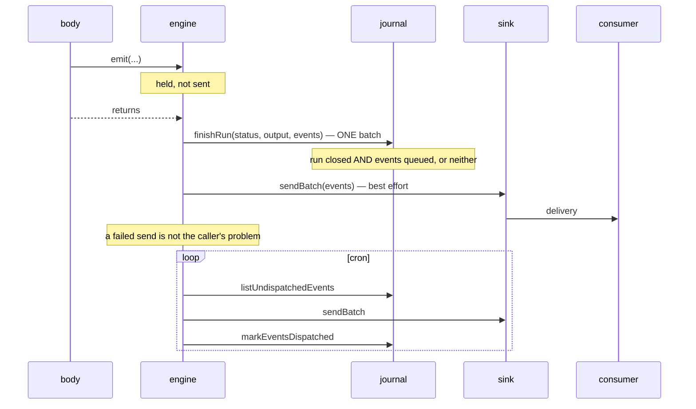

# Design

How the engine works, and why each part is shaped the way it is.

## One engine, two executors

There is one implementation of a run — `executeRun` — and it does not know how a unit of work is
carried out. That is a parameter:

```ts
type StepRunner = <Output>(
  name: string,
  config: StepRetryConfig,
  run: (ctx: { attempt: number }) => Promise<Output>,
) => Promise<Output>
```

The inline executor passes `(_name, _config, run) => run({ attempt: 1 })`. The durable executor
passes the platform's step primitive, which checkpoints the result and retries on failure.

Everything else — the ordering, the step trail, the reverse compensation, the held events, the
atomic finish — is one piece of code, proven once, for both modes. That is the whole reason the
inline mode is trustworthy: it is not a simplified second implementation, it is the same one with
a different runner.

Inline steps deliberately do not retry. The caller is holding a request open, and a saga that
cannot finish now should compensate and say so rather than spend the budget.

## Why compensation is registered from the return value

```ts
const reserveNumber = action(reserve, {
  undo: (number) => release(number), // <- gets exactly what `reserve` returned
})

// or inline, for work with no home of its own:
const number = await step(
  'reserve',
  () => reserve(input),
  (reserved) => release(reserved),
)
```

The obvious alternative is a closure: `run` captures `number` and the undo reads it. That works
inline and breaks durably. On a re-invocation the platform answers a completed step from its
journal without running the body, so the closure never exists — and the undo that lived in it is
gone with it, silently, for exactly the runs that most need undoing.

Returning the compensation value means it is memoised with the step's output, comes back on
every replay, and survives serialisation. The cost is real and written down: a step whose work
succeeded but whose record could not be written throws before it returns, so that step is not
undone — see [`journal-failure`](../test/journal-failure.test.ts), which pins that honestly
rather than pretending otherwise.

## Why undos run in reverse start order

The obvious alternative — reverse _completion_ order — looks more correct and is not stable.
Under `Promise.all`, a durable re-invocation answers completed steps from the journal instantly,
so they finish in the order they were called rather than the order they finished the first time.
The same body would unwind one way on the first invocation and another way on the second.

Start order is a property of the body. Completion order is a property of the weather.
[`parallel`](../test/parallel.test.ts) drives one body twice through a memoising platform and
requires the two unwindings to be identical.

Every undo is attempted even after one refuses, because the one behind a refused undo is the last
thing standing between a tenant and a half-applied mutation. A refusal anywhere makes the whole
run `failed` rather than `compensated`, because `compensated` tells a reader the tenant was left
whole.

## Why nothing unwinds until everything has stopped

`Promise.all` rejects the moment the first of its steps does, while the others are still running.
Unwinding immediately would leave a step that finished a millisecond later registering an undo
with nobody left to run it: the effect stays, the run says it was compensated, and the two
disagree for ever. The engine holds every in-flight step and settles them all before the first
undo runs.

## The transactional outbox

A run holds what it emits until it succeeds, then writes the events **in the same atomic write
that closes the run**:



Three properties, and it is worth being precise about which is which:

- **Atomic**: the run closing and its events being queued. One write.
- **At-least-once**: delivery. The drain is best effort; the sweeper carries the rest; consumers
  dedupe on the envelope id.
- **Deterministic**: the ids. `${runId}:${ordinal}`, so a repeat is recognisable as a repeat.

Nothing here is exactly-once, and nothing anywhere is. The honest version of exactly-once is
at-least-once plus an identity, which is what this is.

A run that was undone puts exactly one thing on the table: `workflow.compensated`. The change did
not happen, so nothing the body emitted is announced — but the fact that a run was undone is
something an audit log and an operator both want. It waits for the sweeper rather than being
drained: a run that fell over is on nobody's hot path.

## Re-invocation

A durable instance can be invoked more than once for one run — a retry after a crash, a resume
whose acknowledgement was lost. The body runs again from the top and the steps come back from the
journal, so everything the engine does _after_ the body had to be made to survive that:

1. **Envelope ids are derived from the run**, not from a clock or a random source. The same body
   walks the same emissions in the same order and arrives at the same ids.
2. **The finish goes through the step runner** as the reserved step `finish-run`, so a platform
   that checkpoints steps closes the run once.
3. **What a step emitted travels home inside its memoised result.** On a replay the step's body
   never runs and its `emit` calls never happen; an announcement kept anywhere else would be
   lost, and the run would close having said less the second time than the first.

If the finish itself was the thing that was lost, the second finish writes exactly the rows the
first one would have, and `ON CONFLICT DO NOTHING` makes it a no-op.
[`engine.replay`](../test/engine.replay.test.ts) drives both windows.

## Idempotency, at two levels

**The run.** A definition may derive a key from its input. The journal refusing the insert _is_
the dedup signal — which is why `insertRun` is specified to throw rather than answer politely,
and why the refusal is typed (`IdempotencyKeyHeldError`) rather than left as a message the engine
would have to match on. Held by living runs, released by dead ones, scoped to the tenant.

**The step.** `ctx.idempotencyKey` is `${runId}:${seq}`, stable across attempts and replays and
different for every other step. This is the one you hand to a payment provider. A compensation
gets `${runId}:${seq}:undo`, because undoing a charge is a refund and a refund is a different
side effect.

## Cancellation

Cooperative, and the word is load-bearing. Nothing here can interrupt somebody else's code
mid-step, and a library that claimed otherwise would be making the dangerous kind of promise.

`requestCancellation` raises a flag on the run record. The engine reads it back from the value
`recordStep` already returns — so noticing costs no extra round trip — and acts on it at the next
step boundary: the step in flight finishes and is recorded, no further step starts, everything
already done is undone in reverse.

A body that catches the `WorkflowCancelledError` and carries on does not get another step, and
does not get to close the run as completed. Stopping is not the body's decision.

In a durable run the timing is worth stating plainly: a run that is asleep or waiting for an
event does not notice until it wakes and its next step has finished. That step runs, and is then
undone with the rest.

## What the sweepers are for

Two things fail in ways nothing else will notice:

- **An inline run whose process died.** It is not running, it was never compensated, and the
  record says `running` for as long as the table exists. `sweepAbandonedRuns` closes those and
  says why. Durable runs are never touched at any age — one may be asleep for a week, and failing
  it because it is old would be the sweep inventing an incident.
- **A drain that could not reach the sink.** `sweepEventOutbox` carries what is left, across every
  tenant, leaving the youngest rows for the run that is probably still draining them.

Both are idempotent and both are your cron.

## The door is the step

"Every effect is a step" is the founding rule, and a rule you have to remember at every call site
is a rule somebody forgets on a Friday afternoon. So do not remember it at every call site.

When effects are reached through one object — a queries module, a service, a Cloudflare binding —
wrap the object once:

```ts
export const seats = actions(seatService, {
  reserve: {
    undo: (held) => seatService.release(held.id),
    announce: (held) => ['seat.reserved', { id: held.id }],
  },
  release: null, // irreversible, and said so on purpose
  trace: true,
})
```

and the bodies go back to being plain code:

```ts
const createBooking = saga('booking.create', async (input: { seat: string }) => {
  if (!(await seats.available(input.seat))) throw new Error('that seat is taken')

  return seats.reserve(input.seat)
})
```

Both lines read as themselves. `reserve` is a recorded, retried, undoable step that announces
what it did. `available` is not listed, so it stays a plain call — except inside a **durable**
saga, where it is memoised as a read-step, because a durable body runs again from the top and a
query answered differently the second time makes the replay diverge.

Outside a saga the wrapped object is the object. That is what makes it safe to export as _the_
module: every caller that is not a saga keeps working, and there is no second import to choose
between.

### Journal the effects, trace the rest

`trace: true` reports every call through the object to the observer as a span — name, a short
rendering of the arguments, how long it took, whether it threw — **with no journal row**.

The two are deliberately different questions. The journal is the effects a run had, and its value
comes from being short enough to read a year later. The call tree is what you want at three in
the morning, and it belongs in a trace where it can be sampled, dropped and never joined against
anything.

Because the engine owns every boundary and every entry point — the run, the steps, the spans, the
events, the outbox — the whole program becomes visible through one seam rather than four.

### Effects declare how they are undone and what they announce

`undo` and `announce` live with the effect, not at the call site. An `announce` is emitted from
_inside_ the step, which is what gives it every property the body's own `emit` has and one more:
it is part of the step's memoised result, so a replayed step announces exactly once, and a run
that is undone announces none of it.

`emit` in a body remains, and is for the composite facts no single effect owns — "the booking was
created" is not something the seat service or the card service can know on its own.

### Totality

```ts
export const undos = {
  reserve: (held) => seatService.release(held.id),
  sendTicket: null,
} satisfies UndoSpec<typeof writes>
```

Adding a write to the module fails compilation until somebody has decided how to undo it. `null`
is a decision — "this one cannot be taken back" — and it has to be written down rather than
arrived at by omission.

## Hooks, and why they are not here yet

A hook is a named extension point inside a run for a **different module** — the plugin that wants
to reserve stock when an order is placed, without the order module knowing it exists. When they
arrive (0.2) they will be steps like any other: their own undo, able to fail the run, undone with
it. Nothing weaker would be honest, because a hook that cannot fail the run is a hook that lets a
half-applied mutation through.

For one team owning the saga, a hook is a function call with extra machinery around it. Call the
function.

## What is deliberately absent

**Flow control.** No per-tenant concurrency, throttling or debouncing. If you need them, a
Durable Object per key or your queue consumer's concurrency settings are the right tools and this
is the wrong layer.

**Isolation.** Two runs touching the same row race exactly as two requests would. A saga is not a
transaction; it is a sequence of transactions with an undo. Use your database's constraints.

**Child workflows as a primitive.** Start a durable workflow from inside a step, key it on the
parent run id, pass `parentRunId` so the child says where it came from, and undo it by cancelling
it. That is the whole pattern, and a primitive would only wrap it.

**A dashboard.** Your run records are rows in your own database.
